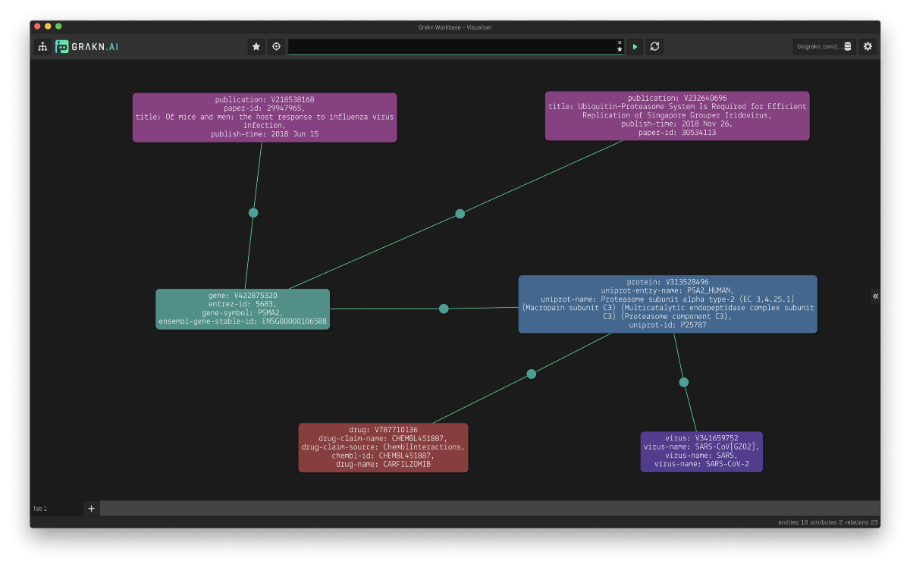
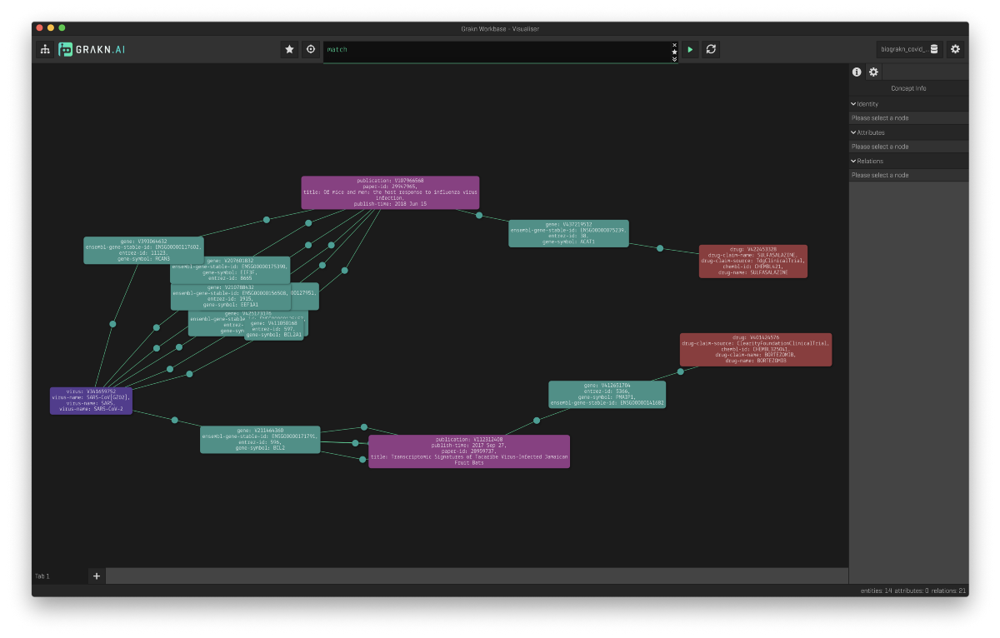

# TypeDB Bio (Covid) Knowledge Graph

**[Overview](#overview)** | **[Installation](#installation)** | **[Datasets](#Datasets)** |
 **[Examples](#examples)** | **[How You Can Help](#How-You-Can-Help)**

[](https://vaticle.com/discord)
[](https://forum.vaticle.com)
[](https://stackoverflow.com/questions/tagged/typedb)
[](https://stackoverflow.com/questions/tagged/typeql)

Bio Covid is an open source project to build a knowledge graph to enable research in COVID-19 and related disease areas.

## Overview
We're excited to release an open source knowledge graph to speed up the research into Covid-19. Our goal is to provide a way for researchers to easily analyse and query large amounts of data and papers related to the virus.

Bio Covid makes it easy to quickly trace information sources and identify articles and the information therein. This first release includes entities extracted from **Covid-19 papers,** and from additional datasets including, **proteins, genes, disease-gene associations, coronavirus proteins, protein expression, biological pathways, and drugs**.

For example, by querying for the virus *SARS-CoV-2,* we can find the associated human protein, *proteasome subunit alpha type-2* (PSMA2), a component of the proteasome, implicated in *SARS-CoV-2* replication, and its encoding gene (*PSMA2*). Additionally, we can identify the drug *carfilzomib,* a known inhibitor of the proteasome that could therefore be researched as a potential treatment for patients with Covid-19. To support the plausibility of this association and its implications, we can easily identify papers in the Covid-19 literature where this protein has been mentioned.



By examining these specific relationships and their attributes, we are directed to the data sources, including publications. This will help researchers to efficiently study the mechanisms of coronaviral infection, the immune response, and help to find targets for the development of treatments or vaccines more efficiently. We can also expand our search to include entities such as publications, organisms, proteins and genes as is shown below:


Our team currently consists of a partnership between [GSK](http://gsk.com/), [Oxford PharmaGenesis](https://www.pharmagenesis.com/) and [Vaticle](https://vaticle.com/)

The schema that models the underlying knowledge graph alongside the descriptive query language, TypeQL, makes writing complex queries an extremely straightforward and intuitive process. Furthermore, TypeDB's automated reasoning, allows Bio Covid to become an intelligent database of biomedical data for the Covid research field that infers implicit knowledge based on the explicitly stored data. TypeDB Data - Bio Covid can understand biological facts, infer based on new findings and enforce research constraints, all at query (run) time.

## Installation
**Prerequesites**: Python >3.6, [TypeDB Core 2.3.3](https://vaticle.com/download#core), [TypeDB Python Client API 2.2.0](https://docs.vaticle.com/docs/client-api/python), [Workbase 2.1.2](https://vaticle.com/download#workbase).

Clone this repo:

```bash 
    git clone https://github.com/vaticle/typedb-data-bio-covid.git
```

Manually download all source datasets and put them in the `Datasets` folder. You can find the links below. 

Set up a virtual environment and install the dependencies:

```bash
    cd <path/to/typedb-data-bio-covid>/
    python3 -m venv .venv
    source .venv/bin/activate
    pip install -r requirements.txt
```

Start typedb
```bash 
    typedb server
```
Start the migrator script

```bash
    python migrator.py -n 4 # insert using 4 threads
```

For help with the migrator script command line options:

```bash
    python migrator.py -h
```

Now grab a coffee (or two) while the migrator builds the database and schema for you!

## Examples
TypeQL queries can be run either on TypeQL console, on workbase or through client APIs.  However, we encourage running the queries on Workbase to have the best visual experience. 

```bash
# Return drugs that are associated to genes, which have been mentioned in the same 
# paper as the gene which is associated to SARS.

match 
$virus isa virus, has virus-name "SARS"; 
$gene isa gene; 
$1 ($gene, $virus) isa gene-virus-association; 
$2 ($gene, $pub) isa mention; 
$3 ($pub, $gene2) isa mention; 
$gene2 isa gene; 
not {$gene2 is $gene;};
$4 ($gene2, $drug); $drug isa drug; 
offset 0; limit 30;
```



## Datasets

Currently the datasets we've integrated include:

* [CORD-NER](https://xuanwang91.github.io/2020-03-20-cord19-ner/): The CORD-19 dataset that the White House released has been annotated and made publicly available. It uses various NER methods to recognise named entities on CORD-19 with distant or weak supervision.
* [Uniprot](https://www.uniprot.org/uniprot/?query=proteome:UP000005640%20reviewed:yes): We’ve downloaded the reviewed human subset, and ingested genes, transcripts and protein identifiers.
* [Coronaviruses](https://github.com/vaticle/typedb-data-bio-covid/tree/master/Dataset/Coronaviruses): This is an annotated dataset of coronaviruses and their potential drug targets put together by Oxford PharmaGenesis based on literature review.
* [DGIdb](http://www.dgidb.org/downloads): We’ve taken the *Interactions TSV* which includes all drug-gene interactions.
* [Human Protein Atlas](https://www.proteinatlas.org/about/download): The *Normal Tissue Data* includes the expression profiles for proteins in human tissues.
* [Reactome](https://reactome.org/download/current/UniProt2Reactome_All_Levels.txt): This dataset connects pathways and their participating proteins.
* [DisGeNet](https://www.disgenet.org/downloads): We’ve taken the *curated gene-disease-associations* dataset, which contains associations from Uniprot, CGI, ClinGen, Genomics England and CTD, PsyGeNET, and Orphanet.
* [SemMed](https://skr3.nlm.nih.gov/SemMedDB/dbinfo.html): This is a subset of the SemMed version 4.0 database

In progress:

* [CORD-19](https://www.semanticscholar.org/cord19): We incorporate the original corpus which includes peer-reviewed publications from bioRxiv, medRxiv and others.    
    * TODO: write migrator script
* [TissueNet](https://netbio.bgu.ac.il/labwebsite/tissuenet-v-2-download/) 
    * TODO: `./Migrators/TissueNet/TissueNetMigrator.py` incomplete: only migrates a single data file and is not called in `./migrator.py`. 

We plan to add many more datasets!

## **How You Can Help**

This is an on-going project and we need your help! If you want to contribute, you can help out by helping us including:

- Migrate more data sources (e.g. clinical trials, DrugBank, Excelra)
- Extend the schema by adding relevant rules
- Create a website
- Write tutorials and articles for researchers to get started

If you wish to get in touch, please talk to us on the #typedb-data-bio-covid channel on our Discord ([link here](https://www.vaticle.com/discord)).

- Konrad Myśliwiec ([LinkedIn](https://www.linkedin.com/in/konrad-my%C5%9Bliwiec-764ba9163/))
- Kim Wager ([LinkedIn](https://www.linkedin.com/in/kimwager/))
- Tomás Sabat ([LinkedIn](https://www.linkedin.com/in/tom%C3%A1s-sabat-83265841/))
